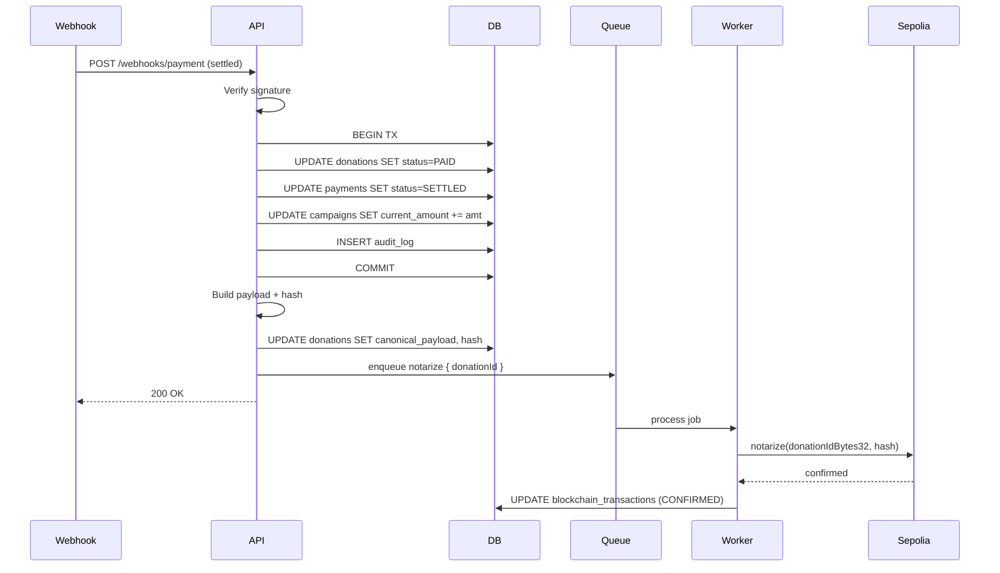
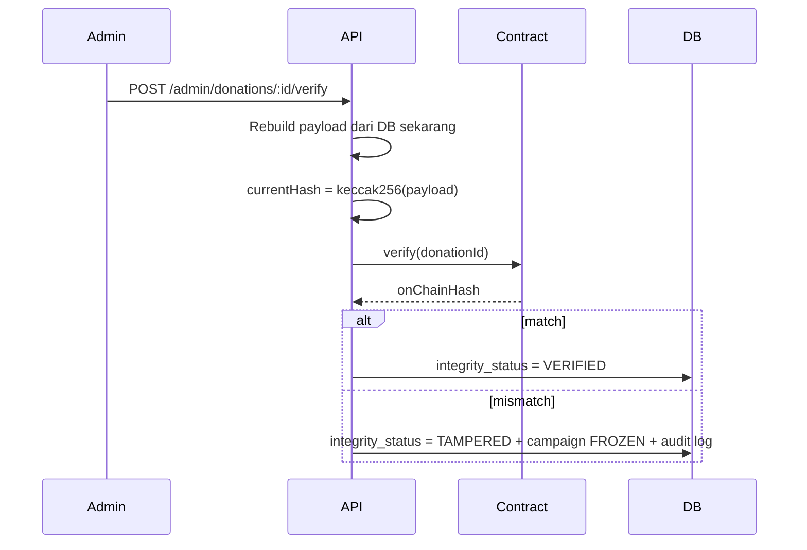

# Blockchain Flow

Blockchain cuma nyimpan **hash**, bukan data asli. Hashing tetap off-chain. On-chain = "sidik jari" yang gak bisa diubah.

## 1. Flow

```
PAID → hashing → queue → relayer → Sepolia → txHash
```

1. Donation jadi `PAID` (dari webhook)
2. Backend build canonical payload
3. Hash keccak256 → bytes32
4. Simpan hash + payload ke DB
5. Enqueue BullMQ job
6. Worker pickup, submit tx via relayer
7. Contract simpan hash, emit event
8. Worker tunggu 2 konfirmasi
9. Update DB: txHash, blockNumber, status=CONFIRMED

**Kenapa async?** Webhook harus balas 200 cepat (~5s timeout). Tx Sepolia butuh ~15s. Kalau sync → webhook timeout → retry terus.

## 2. Kapan Write

Cuma saat donation `PAID`. **Sekali tulis, gak bisa diubah** (contract revert kalau `donationId` udah ada). Kalau blockchain down, donation tetap PAID — retry lewat queue.

## 3. Sequence



## 4. Canonical Payload

```
v1|donationId|integritySubjectId|amount|timestamp
```

Contoh:
```
v1|a1b2c3d4-e5f6-7890-abcd-ef1234567890|STU-00042|100000|1790600000
```

| Field | Keterangan |
|---|---|
| `v1` | Version prefix |
| `donationId` | UUID lowercase |
| `integritySubjectId` | Pseudonymous (bukan email/nama) |
| `amount` | Integer minor units |
| `timestamp` | Unix seconds UTC |

**Deterministik.** Input sama = hash sama. **Pseudonymous** karena privacy — sekali on-chain, selamanya publik.

## 5. Hash

```
hash = keccak256(UTF8(canonicalPayload))
```

Sifat: deterministik, avalanche effect (1 char beda = hash beda total), one-way.

Simpan di: `donations.hash` (DB) + `_records[donationId].hash` (contract).

## 6. Queue (BullMQ)

Queue name: `blockchain-notarize`. Job payload: `{ donationId }`.

```typescript
queue.add('notarize', { donationId }, {
  attempts: 5,
  backoff: { type: 'exponential', delay: 2000 },
  removeOnComplete: 100,
});
```

Backoff: 2s → 4s → 8s → 16s. Total ~30 detik.

## 7. Retry & Failure

**State machine:** `QUEUED → SUBMITTED → CONFIRMED` · gagal → `RETRYING` · max 5x → `FAILED`.

| Scenario | Handling |
|---|---|
| RPC error | Retry backoff |
| Out of gas | Retry setelah top-up |
| `AlreadyNotarized` revert | Anggap sukses, set CONFIRMED |
| `ZeroHash` revert | Set FAILED, alert admin |
| Nonce mismatch | Retry dengan nonce baru |
| Tx dropped | Resubmit gas lebih tinggi |

Kalau `FAILED`: insert `audit_logs` action `BLOCKCHAIN_NOTARIZE_FAILED`.

## 8. Audit (READ ONLY)

Dipicu: admin manual · laporan user · sistem flag · cron mingguan.



**Kenapa ketahuan?** Keccak256 deterministik. Ubah amount `100000`→`900000` → payload beda → hash beda → TAMPERED.

## 9. Kalau Tampered

`TAMPERED` → `campaign.status = FROZEN` → audit log → disbursement locked. Unfreeze cuma admin manual + investigasi.

## 10. Yang Gak Bisa

| Aksi | Bisa? |
|---|---|
| Ubah / hapus hash on-chain | ❌ |
| Notarize ulang | ❌ revert |
| Notarize hash zero | ❌ revert |
| Baca hash (view) | ✅ gratis |

## 11. Critical Invariant

**Payment status NEVER affected by blockchain state.** Donation `PAID` = permanent. Blockchain `FAILED` = cuma masalah notarization. Uang udah masuk via Midtrans — blockchain cuma bukti.

## 12. Env & Monitoring

```bash
BLOCKCHAIN_RPC_URL=https://sepolia.infura.io/v3/KEY
CONTRACT_ADDRESS=0x...
RELAYER_PRIVATE_KEY=0x...   # HANYA di backend
CHAIN_ID=11155111
```

Validate `CHAIN_ID === 11155111` sebelum submit. Monitor: relayer balance (< 0.02 ETH alert), queue depth (> 100), failed jobs (24h > 5), avg time (> 60s). Bull Board di `/admin/queues`.