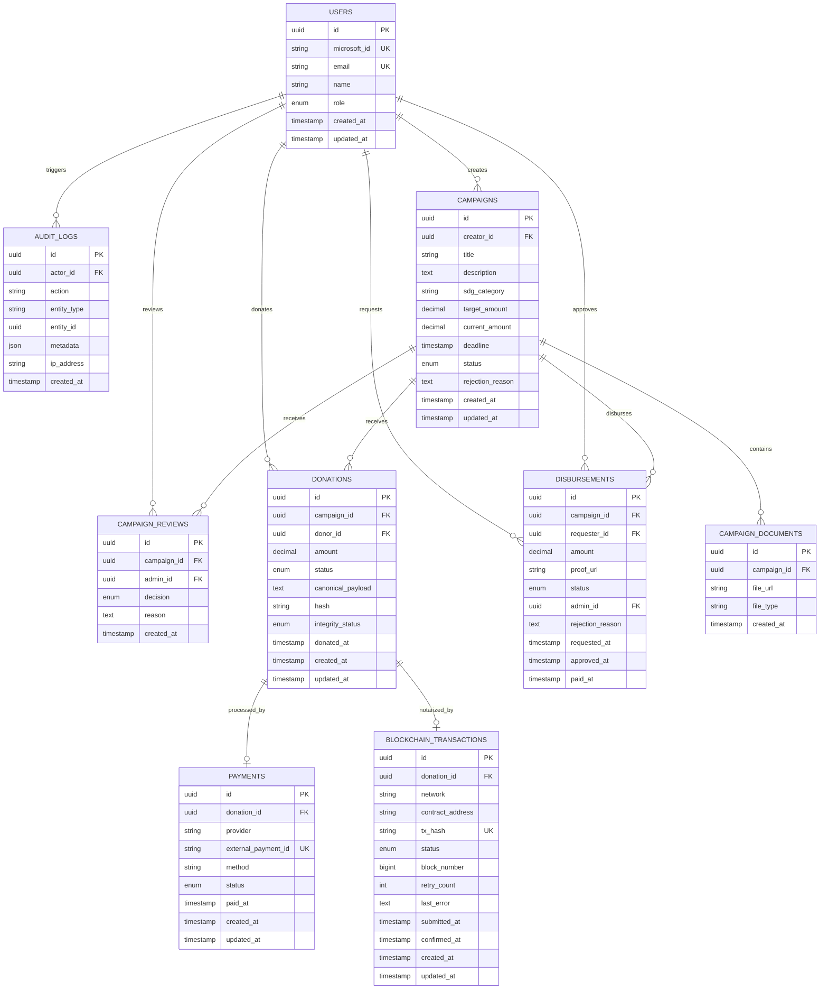

# Database Schema

**Stack:** PostgreSQL 16 + Prisma ORM. File asli: `apps/api/prisma/schema.prisma`.

## ERD

## Enum

| Enum | Values |
|---|---|
| Role | STUDENT, ADMIN |
| CampaignStatus | DRAFT, PENDING_REVIEW, ACTIVE, REJECTED, FROZEN, COMPLETED |
| ReviewDecision | APPROVE, REJECT |
| DonationStatus | PENDING, PAID, FAILED, EXPIRED, REFUNDED |
| IntegrityStatus | PENDING, VERIFIED, TAMPERED |
| PaymentStatus | PENDING, SETTLED, FAILED, EXPIRED |
| BlockchainStatus | QUEUED, SUBMITTED, CONFIRMED, FAILED, RETRYING |
| DisbursementStatus | REQUESTED, APPROVED, REJECTED, PAID |

## Models

**User** — `microsoftId` UK (dari `sub` claim) · `email` UK (@binus.ac.id) · `role` default STUDENT.
**AuditLog** — `actorId` nullable (system actions) · `metadata` JSONB.
**Campaign** — `creatorId` FK · `sdgCategory` (17 SDG) · `targetAmount`/`currentAmount` decimal(15,2) · `status` default DRAFT · `rejectionReason` nullable.
**CampaignReview** — `campaignId` + `adminId` FK · `decision` APPROVE/REJECT · `reason` wajib saat reject.
**Donation** — `campaignId` + `donorId` FK · `canonicalPayload` + `hash` (audit) · `integrityStatus` PENDING/VERIFIED/TAMPERED.
**Payment** — `donationId` UK (1:1) · `externalPaymentId` UK (Midtrans) · `method` QRIS/VA · `paidAt` nullable.
**BlockchainTransaction** — `donationId` UK (1:1) · `txHash` UK · `status` QUEUED→SUBMITTED→CONFIRMED · `blockNumber`/`submittedAt`/`confirmedAt` nullable.
**Disbursement** — `requesterId` + `adminId` FK · `status` REQUESTED→APPROVED/REJECTED→PAID · `adminId`/`rejectionReason`/timestamps nullable.
**CampaignDocument** — `campaignId` FK · `fileUrl` + `fileType`.

## Design Decisions

| Keputusan | Alasan |
|---|---|
| `Decimal(15,2)` untuk money | Presisi, hindari float |
| `donation_id` UK di payments + blockchain_transactions | Enforce 1:1 |
| Cascade delete di documents/reviews/payments | Cleanup otomatis |
| NO cascade campaign → donations | Jangan kehilangan record |
| `actor_id` nullable | System actions |
| `admin_id` nullable di disbursements | Baru diisi saat approve |

## Indexes

`campaigns(status, deadline)` · `campaigns(creatorId)` · `donations(campaignId, status)` · `donations(donorId)` · `audit_logs(entityType, entityId)` · `audit_logs(createdAt)`.

## Rules

- Semua schema change WAJIB lewat Prisma migration
- Migration gak boleh diubah setelah commit
- Jangan `db push` di production — pakai `migrate deploy`