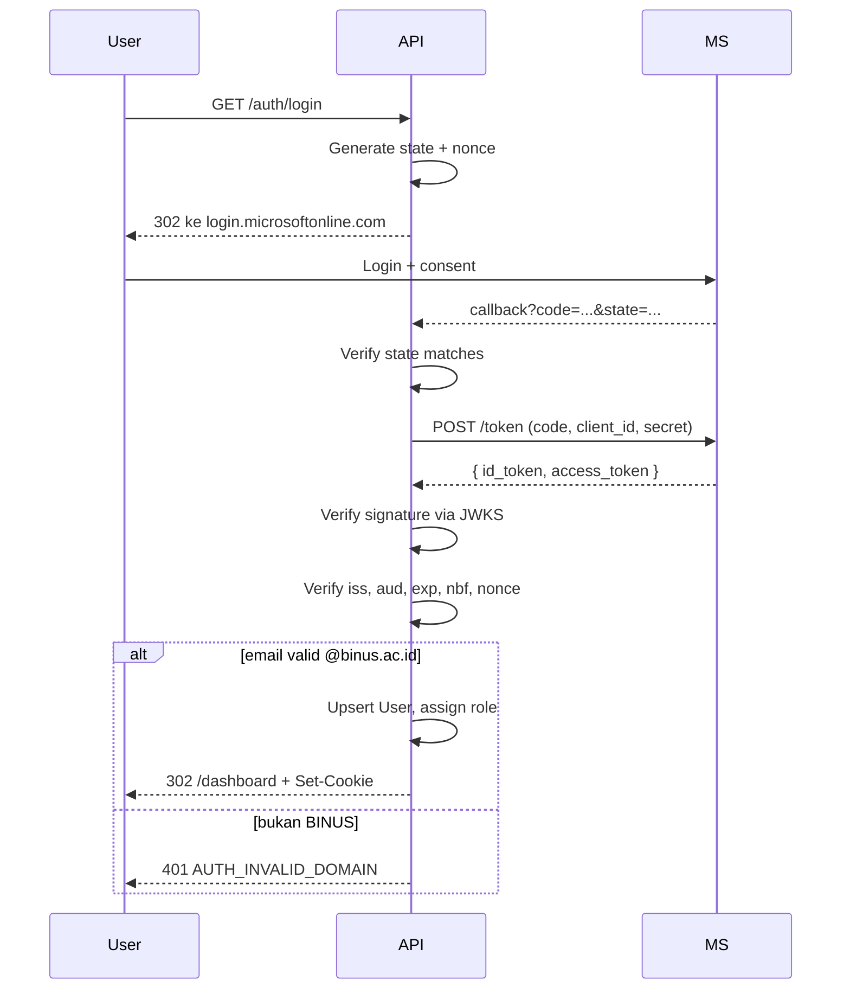

# Microsoft BINUS SSO Research

**Provider:** Microsoft Entra ID · **Protocol:** OIDC · **Tenant:** BINUS · **Library:** `openid-client`

## 1. Azure Portal Setup

1. portal.azure.com → **Entra ID → App registrations → New**
2. Name: FundChain · Account types: BINUS only · Redirect URI: Web → `https://api.fundchain.id/api/v1/auth/callback`
3. Catat **Application (client) ID** → `AZURE_CLIENT_ID`, **Directory (tenant) ID** → `AZURE_TENANT_ID`
4. Certificates & secrets → New client secret → copy value → `AZURE_CLIENT_SECRET`
5. API permissions: `openid`, `profile`, `email`, `User.Read` → Grant admin consent
6. Token config → Optional claims → ID token → add `email`, `preferred_username`

**Redirect URI:**

| Env | URI |
|---|---|
| Dev | `http://localhost:3000/api/v1/auth/callback` |
| Prod | `https://api.fundchain.id/api/v1/auth/callback` |

Rules: HTTPS di prod (kecuali localhost), exact match (no wildcard), case-sensitive path. Salah → error `AADSTS50011`.

## 2. OIDC Flow



**Endpoints:** authorize, token, JWKS, logout di `login.microsoftonline.com/{tenant}/oauth2/v2.0/*`.

**Authorize params:** `client_id`, `response_type=code`, `redirect_uri`, `scope=openid profile email`, `state`, `nonce`.

## 3. Tenant & Domain Restriction

Set tenant ke BINUS tenant ID (bukan `common`). `common` izinin user dari tenant manapun login.

**Defense in depth** — tetap validate email di app:
```typescript
if (!email.endsWith('@binus.ac.id')) {
  throw new AppError('Only @binus.ac.id', 401, 'AUTH_INVALID_DOMAIN');
}
```

Pakai `preferred_username` atau `upn`, **jangan** `email` claim (bisa spoofed).

## 4. Role Mapping

- Default: `STUDENT`. Admin: dari `ADMIN_EMAILS` env (comma-separated).
- **Never trust role dari frontend.**

```typescript
const email = claims.preferred_username || claims.email;
validateEmail(email);
const role = ADMIN_EMAILS.includes(email) ? 'ADMIN' : 'STUDENT';

await prisma.user.upsert({
  where: { email },
  update: { name: claims.name, microsoftId: claims.sub },
  create: { microsoftId: claims.sub, email, name: claims.name, role },
});
```

Role cuma di-set saat create user. Jangan update tiap login (bisa overwrite promote manual).

## 5. Session

Verify id_token, lalu bikin session JWT sendiri (bukan pakai id_token Microsoft — expire cepet, gak bisa custom claims).

```typescript
const token = jwt.sign(
  { sub: user.id, email: user.email, role: user.role },
  process.env.SESSION_JWT_SECRET,
  { expiresIn: '8h', issuer: 'fundchain' }
);

res.cookie('fundchain_session', token, {
  httpOnly: true,
  secure: process.env.NODE_ENV === 'production',
  sameSite: 'lax',
  maxAge: 8 * 60 * 60 * 1000,
  path: '/',
});
```

**Wajib verify id_token:** signature (JWKS), `iss` (tenant BINUS), `aud` (client_id), `exp`, `nbf`, `nonce`.

## 6. Env Variables

```bash
AZURE_TENANT_ID=<uuid>
AZURE_CLIENT_ID=<uuid>
AZURE_CLIENT_SECRET=<secret>
AZURE_REDIRECT_URI=http://localhost:3000/api/v1/auth/callback
SESSION_JWT_SECRET=<64-char-hex>
SESSION_COOKIE_NAME=fundchain_session
SESSION_TTL_HOURS=8
ADMIN_EMAILS=admin1@binus.ac.id,admin2@binus.ac.id
```

Generate secret: `openssl rand -hex 32`. **Jangan commit `.env`.**

## 7. Security Rules

| Rule | Alasan |
|---|---|
| Verify `state` | CSRF |
| Verify `nonce` | Replay attack |
| Verify `iss` === BINUS tenant | Cross-tenant token |
| Verify `aud` === client_id | Token dari app lain |
| Pakai `preferred_username` | `email` bisa spoofed |
| Cookie httpOnly+Secure+SameSite=Lax | XSS + CSRF |
| Session TTL 8 jam | Limit damage |
| Never trust role dari frontend | Enforce backend |
| Log login attempts | Audit trail |

## 8. Setup Checklist

- [ ] Register app di Azure Portal
- [ ] Redirect URI: localhost + production
- [ ] API permissions + admin consent
- [ ] Token config: `email`, `preferred_username`
- [ ] Generate secret (24 bulan), copy ke `.env`
- [ ] Generate `SESSION_JWT_SECRET`
- [ ] Test login @binus.ac.id → success
- [ ] Test non-BINUS → 401
- [ ] Test state mismatch → 400

## 9. Common Errors

| Error | Fix |
|---|---|
| `AADSTS50011` | Redirect URI mismatch — cek exact match |
| `AADSTS65001` | Grant admin consent |
| `AADSTS700054` | Client secret expired — generate baru |
| `AADSTS50020` | User dari tenant lain — restrict tenant |
| `invalid_signature` | Fetch JWKS ulang |
| `invalid_nonce` | Cek session storage |

## 10. Logout

```typescript
res.clearCookie('fundchain_session');
res.redirect(`https://login.microsoftonline.com/${TENANT_ID}/oauth2/v2.0/logout` +
  `?post_logout_redirect_uri=${encodeURIComponent('http://localhost:5173/login')}`);
```

Daftarkan `post_logout_redirect_uri` di Azure Portal → Authentication → Front-channel logout URL.