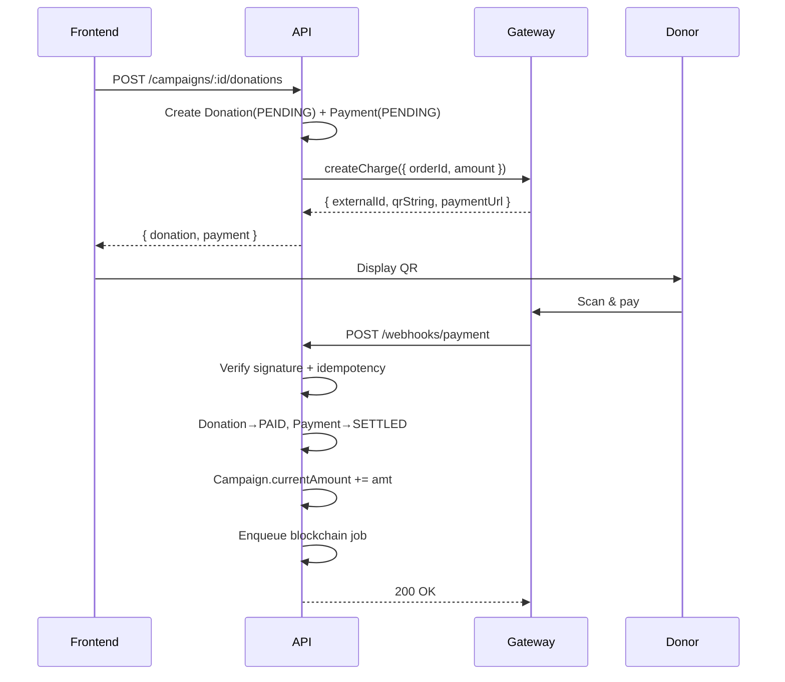

# Payment Gateway Research

**MVP:** Pakasir (fee 0.7%) · **Production:** Midtrans (fitur lengkap, docs terbaik).

## 1. Provider Comparison

| Provider | QRIS | VA | Fee QRIS | Sandbox |
|---|---|---|---|---|
| **Pakasir** | ✅ | ❌ | ~0.7% | ✅ Free |
| **Midtrans** | ✅ | ✅ | 2.9% + Rp2.000 | ✅ Free |
| Xendit | ✅ | ✅ | 2.9% | ✅ Free |
| Duitku | ✅ | ✅ | 1.5-3% | ✅ Free |
| Stripe | ❌ | ❌ | — | ✅ Free |

**Pakasir:** aggregator QRIS, murah, docs minimal, settle delay 1-2 hari.
**Midtrans:** direct gateway, dana langsung merchant, docs lengkap, onboarding ribet.
**Strategy:** adapter pattern — swap via `PAYMENT_PROVIDER` env.

## 2. Adapter Pattern

```typescript
export interface PaymentGateway {
  createCharge(p: { orderId: string; amount: number; customerName: string; customerEmail: string }):
    Promise<{ externalId: string; qrString?: string; paymentUrl?: string; expiresAt: Date }>;
  verifyWebhookSignature(payload: any, signature: string): boolean;
  parseWebhook(payload: any): { externalId: string; orderId: string;
    status: 'SETTLED' | 'FAILED' | 'EXPIRED'; amount: number; method: string };
}
```

Implementasi: `PakasirAdapter` · `MidtransAdapter`. Factory pilih via `process.env.PAYMENT_PROVIDER`.

## 3. Flow



**Webhook** = sumber kebenaran. **Polling** = fallback (3 detik, max 5 menit).

## 4. Webhook Signature

**Midtrans:** `sha512(order_id + status_code + gross_amount + server_key)`.
**Pakasir:** HMAC-SHA256 body dengan webhook secret.

```typescript
import { createHash, createHmac, timingSafeEqual } from 'node:crypto';

function verifyMidtrans(body, serverKey) {
  const input = `${body.order_id}${body.status_code}${body.gross_amount}${serverKey}`;
  const expected = createHash('sha512').update(input).digest('hex');
  return timingSafeEqual(Buffer.from(expected), Buffer.from(body.signature_key));
}
```

## 5. Idempotency & Amount Validation

```typescript
async function handleWebhook(body) {
  const payment = await prisma.payment.findUnique({
    where: { externalPaymentId: body.transaction_id }
  });
  if (payment?.status === 'SETTLED') return { received: true, replayed: true };

  // JANGAN percaya amount dari webhook — validate vs DB
  if (Number(body.gross_amount) !== Number(payment.amount)) {
    throw new AppError('Amount mismatch', 400, 'PAYMENT_AMOUNT_MISMATCH');
  }

  // process: update payment, donation, campaign, enqueue blockchain
}
```

Unique constraint di `external_payment_id` = safety net. Log semua webhook ke `audit_logs`.

## 6. Payment States

| Provider | Internal | Action |
|---|---|---|
| `settlement`, `capture` | `SETTLED` | Mark PAID, enqueue blockchain |
| `pending` | `PENDING` | Ignore |
| `deny`, `cancel` | `FAILED` | Mark failed |
| `expire` | `EXPIRED` | Mark expired |

**Timeline:** bayar → webhook (~1m) → Donation PAID → enqueue → submit tx (~30s) → confirmed (~15s). Total E2E ~2-3 menit.

## 7. Sandbox

**Midtrans:** dashboard.sandbox.midtrans.com · Server Key `SB-Mid-server-xxx` · test cards: `4811...1114` (success), `4911...1113` (fail) · webhook URL di Settings → Configuration.
**Pakasir:** pakasir.id · API key dari dashboard · webhook URL di project settings.
**Local:** `ngrok http 3000` → copy URL → set di provider dashboard.

## 8. Env Variables

```bash
PAYMENT_PROVIDER=midtrans   # atau pakasir
MIDTRANS_SERVER_KEY=SB-Mid-server-xxx
MIDTRANS_CLIENT_KEY=SB-Mid-client-xxx
MIDTRANS_IS_PRODUCTION=false
PAKASIR_API_KEY=xxx
PAKASIR_PROJECT=fundchain
PAKASIR_WEBHOOK_SECRET=xxx
```

## 9. Failure Handling

| Scenario | Action |
|---|---|
| Invalid signature | 401, log audit, jangan update status |
| Amount mismatch | 400, log `PAYMENT_AMOUNT_MISMATCH`, alert admin |
| Duplicate webhook | 200 idempotent |
| Unknown order_id | 404, log |
| Provider down | Retry 3x backoff, return 503 |
| Webhook gak datang | Polling 3s, expire 15 menit |

## 10. Security Rules

- Verify signature setiap webhook
- Idempotency via `external_payment_id`
- Never trust amount dari webhook
- Order ID pakai UUID (jangan auto-increment)
- Secret di env, rotate berkala
- Rate limit generous (provider bisa burst)